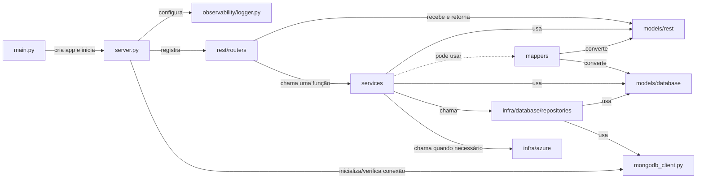
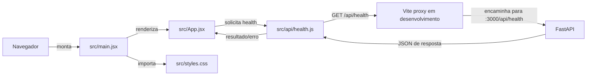

# Instruções de arquitetura do projeto

Este repositório contém um backend em Python com FastAPI e um frontend em React com Vite. Ao alterar o código, siga as responsabilidades e os fluxos abaixo. A árvore indica os arquivos e diretórios atualmente presentes; diretórios vazios ou com `.gitkeep` representam pontos de extensão, não funcionalidades implementadas.

## Backend

### Estrutura atual

```text
backend/
├── src/
│   ├── infra/
│   │   ├── azure/                         # reservado; atualmente contém .gitkeep
│   │   └── database/
│   │       ├── mongodb_client.py          # conexão, ping e acesso a collections
│   │       └── repositories/              # reservado; atualmente contém .gitkeep
│   ├── mappers/                           # reservado; atualmente contém .gitkeep
│   ├── models/
│   │   ├── database/                      # reservado; atualmente contém .gitkeep
│   │   └── rest/
│   │       └── health.py                  # HealthResponse
│   ├── observability/
│   │   └── logger.py
│   ├── rest/
│   │   └── routers/
│   │       ├── __init__.py                # descoberta e registro de routers
│   │       └── health.py                  # GET /health (montado sob /api)
│   ├── services/                          # reservado; atualmente contém .gitkeep
│   ├── main.py                            # carrega ambiente e inicia Uvicorn
│   └── server.py                          # cria e configura o FastAPI
└── tests/                                 # atualmente sem testes implementados
```

### Responsabilidades dos pacotes

- `backend/src/infra/database`: conexões e recursos ligados ao banco de dados.
- `backend/src/infra/database/mongodb_client.py`: cria e mantém o cliente compartilhado do MongoDB, verifica a conexão e obtém collections. A implementação existente concentra essas funções neste arquivo; o nome `_client.py` do diagrama de referência não corresponde ao arquivo atual.
- `backend/src/infra/database/repositories`: deve conter os repositories, idealmente um por collection. Eles encapsulam operações de persistência, usam o cliente MongoDB e os schemas de `backend/src/models/database`. O diretório ainda está vazio.
- `backend/src/infra/azure`: integrações e acesso a recursos Azure, como Azure Cognitive Services. O diretório ainda está vazio.
- `backend/src/models/rest`: contratos de entrada e saída da API. Os modelos devem herdar de `pydantic.BaseModel`; use `Field` para declarar validações e descrições claras. O modelo existente é `HealthResponse`.
- `backend/src/models/database`: modelos que representam os documentos/schemas das collections do banco. O diretório ainda está vazio.
- `backend/src/services`: regras de negócio e coordenação entre routers e infraestrutura. Services usam repositories para persistência e `infra/azure` para recursos Azure; podem usar modelos REST, modelos de banco e mappers para transformar dados. O fluxo esperado é uma função de service por chamada de rota. O diretório ainda está vazio.
- `backend/src/mappers`: funções de conversão entre objetos de borda e objetos internos, por exemplo request REST para um ou mais modelos de banco e resultado de persistência para response REST. São usados pelas services quando a conversão for necessária. O diretório ainda está vazio.
- `backend/src/rest/routers`: define as rotas HTTP. As rotas recebem/devolvem modelos de `models/rest` e delegam o trabalho a uma única função de service. A rota de health existente consulta diretamente `test_connection`; ao adicionar endpoints de negócio, mantenha o fluxo via service.
- `backend/src/server.py`: configura o FastAPI, o lifespan e registra as rotas com `regiter_routes`. Atualmente monta as rotas sob `/api`.
- `backend/src/main.py`: carrega as variáveis de ambiente, cria o app com `create_app` e inicia o Uvicorn na porta 3000.
- `backend/src/observability`: configuração de logging usada no ciclo de vida do servidor.

### Fluxo de comunicação

O diagrama abaixo representa a arquitetura descrita e a imagem de referência `docs/Diagrama Pacotes Backend.drawio.png`. A imagem representa a intenção arquitetural; alguns componentes estão reservados e ainda não implementados no código atual.



### Testes do backend

- Mantenha os testes diretamente em `backend/tests`; não crie subpastas nessa pasta.
- Nomeie cada arquivo como `test_<nome_do_pacote_inteiro>.py`, usando o caminho lógico do pacote no nome. Exemplo: `backend/src/infra/database/repositories/customer.py` pode ser coberto por `backend/tests/test_infra_database_repositories_customer.py`.

## Frontend

### Estrutura atual

```text
frontend/
├── index.html                         # documento HTML e elemento root
├── vite.config.js                     # plugin React e proxy local de /api
├── package.json                       # scripts e dependências
└── src/
    ├── api/
    │   └── health.js                  # chamada HTTP ao health check
    ├── App.jsx                         # tela de monitoramento e estado do health check
    ├── main.jsx                        # inicializa React, StrictMode e CSS global
    └── styles.css                      # estilos globais
```

O frontend usa React 19 e Vite. `main.jsx` monta `App` no elemento `#root` e importa os estilos globais. `App.jsx` compõe a tela de monitoramento, consulta o estado da API, apresenta carregamento/erro/resultado e permite atualizar manualmente. `api/health.js` encapsula o `GET /health`; a URL base vem de `VITE_BACKEND_API_URL` e usa `/api` por padrão. Em desenvolvimento, Vite encaminha `/api` para `http://localhost:3000`.

### Convenções para evolução

- Mantenha chamadas HTTP em `src/api`, separadas da apresentação. Crie um módulo por recurso ou domínio à medida que a API crescer.
- Use `App.jsx` para compor páginas e coordenar o estado da aplicação; extraia componentes reutilizáveis para `src/components` quando necessário e páginas/fluxos maiores para `src/pages`.
- Coloque hooks reutilizáveis em `src/hooks` e recursos estáticos em `src/assets`. Crie esses diretórios somente quando houver conteúdo para eles.
- Mantenha estilos globais em `styles.css`; prefira estilos locais/co-localizados para componentes quando o projeto adotar essa organização.
- Leia configurações de endpoint por variáveis `VITE_*`; não coloque segredos no bundle do navegador.
- Scripts disponíveis: `npm run dev`, `npm run build` e `npm run preview`.

### Fluxo de dados atual



## Alinhamento da documentação e melhorias observadas

- Ao documentar arquitetura, diferencie código existente de diretórios planejados. Não descreva placeholders como integrações já implementadas.
- A descrição inicial cita `infra/database/mongodb/_client.py`, mas a implementação e a imagem fornecida usam `infra/database/mongodb_client.py`. Se o pacote `mongodb/` for adotado futuramente, atualize imports, configuração e documentação em conjunto.
- O exemplo atual de health check é uma exceção simples que acessa o client diretamente. Endpoints de negócio devem seguir o fluxo router → service → repository/infra.
- A estrutura do frontend é enxuta hoje. Quando novas telas ou domínios forem adicionados, os diretórios sugeridos acima evitam concentrar API, estado, layout e apresentação em `App.jsx`.
